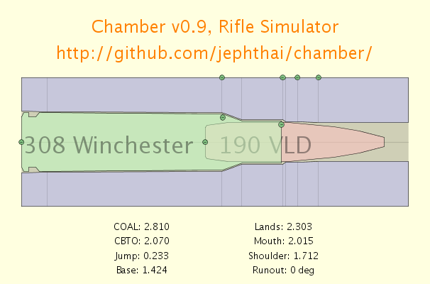
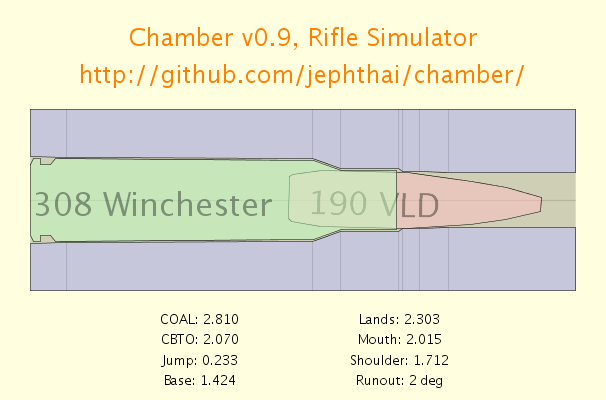
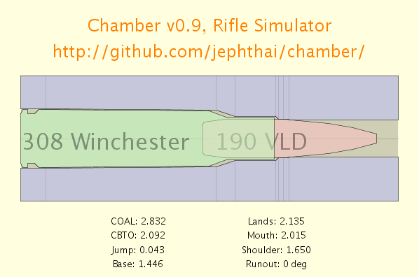

chamber
=======

This program is a simple toy to allow visualization of different
conditions when chambering a rifle round.  There are a bewildering
variety of factors that may contribute to safety issues, affect
accuracy, or even generate confusion when discussing such things on
the Internet.

This software presents the user with some options for rendering an
image of a chambered round.  Many of the variables in chamber
dimensions, reloading parameters, and error conditions can be
manipulated by the user. 

The software is written for the [Processing](http://www.processing.org)
programming environment (thus, Java).

Demonstration
=============

The GUI presents a rendering of a rifle chamber with an inserted
cartridge.  Small green "handles" allow the user to click and drag
different aspects of the visual to adjust the presentation to show the
desired configuration.  The following screenshot shows an example of
the GUI:

For example, here is a representation of one of my accurate .308
loads.  This shows a representation of my actual chamber (my lands are
closer than the max spec), with my load designed to jump 0.043" to the
lands.  In the following screenshot, the difference is subtle (these
are small distinctions), but in full-screen it is more visible.

Finally, this may be useful to demonstrate loading errors.  For
example, this is a depiction of bullet runout, where the bullet is not
loaded concentric with the axis of the cartridge case.  This results
in a wobble, which deteriorates accuracy.  (Note: at this time, runout
is only configured in code -- I'm still struggling with how to do it
effectively in the GUI):

Here is another example showing a case where the shoulder has been
bumped too far back during resizing.  This could cause an unsafe
condition, or at least split the case:

Installation and use
====================

To use Chamber, you will need to either install
[Processing](http://www.processing.org/) and run from source (the
chamber.pde file), or you can download the binary packages.  Even
running the packaged version, you will need to have
[Java](http://www.java.com/) installed.

To download and run the Windows version, for example, you can download
[the ZIP file](chamber-v0.9.zip).  Unzip this using your normal
method, and double-click on the file named "chamber.exe".